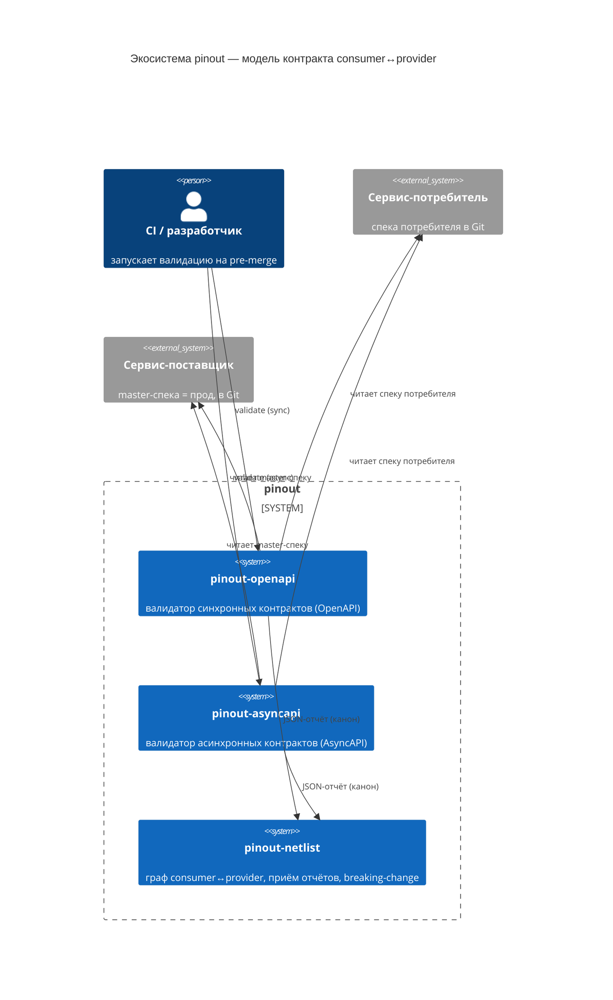

# pinout

Экосистема инструментов, которая проверяет совместимость сервисов по их машиночитаемым спецификациям (OpenAPI, AsyncAPI) **на pre-merge стадии в CI** — без генерации и публикации клиентских библиотек.

> Источник истины — спецификация в Git. Артефакт не публикуется; вместо этого пара «потребитель ↔ поставщик» сверяется автоматически до деплоя.

## Концепция

В электронике **pinout** — это распиновка микросхемы: какие сигналы идут на какие пины, какие напряжения, какие протоколы. Чтобы две микросхемы заработали вместе, их распиновки должны быть совместимы.

В микросервисной архитектуре роль pinout играет спецификация сервиса — OpenAPI для синхронных REST API или AsyncAPI для асинхронного обмена сообщениями. Спецификация описывает «распиновку» сервиса: какие операции он принимает, какие сообщения отправляет, по каким каналам и протоколам.

`pinout` делает то же, что continuity test на печатной плате: проверяет, что распиновки потребителя и поставщика сходятся **до** того, как сервисы попадут в продакшн и начнут падать на runtime-несовместимостях.

## Модель контракта: потребитель и поставщик

Для любого взаимодействия есть две роли:

- **Поставщик (provider)** — сервис, предоставляющий контракт (REST-эндпоинты или каналы/сообщения).
- **Потребитель (consumer)** — сервис, опирающийся на этот контракт.

Каждая сторона описана своей спецификацией в своём репозитории. pinout не вводит отдельный «язык контракта» — контрактом служит сама спецификация:

| Взаимодействие | Спецификация | Что сверяется | Модуль |
|---|---|---|---|
| Асинхронное (брокеры сообщений) | AsyncAPI 3.0 | канал, протокол, структура сообщений request/reply | `pinout-asyncapi` |
| Синхронное (REST) | OpenAPI 3.x | path/operation, схемы request/response, коды ответов | `pinout-openapi` |

Конфигурация пары едина для обоих модулей — файл `contract-tests.yaml` (путь/URL к спеке потребителя, путь/URL к master-спеке поставщика, перечень используемых потребителем каналов/операций).

### Карта экосистемы (C4 — System Context)



## Обоснование: почему спека-в-Git, а не сгенерированные библиотеки

### Несущий инвариант экосистемы

Спека-как-источник-истины безопасна только при одном условии:

> **Каждый сервис конформен своей собственной спецификации — и это доказано его собственными компонентными тестами.**

В принятой методологии разработки ([service-template](https://github.com/ubik-life/service-template/)) это уже выполняется: компонентные тесты гоняют сервис как чёрный ящик против его OpenAPI/AsyncAPI и README, а внешние зависимости заменяются stub-сервисами по реальному протоколу. Отсюда следствие, на котором стоит весь pinout:

> сервис конформен своей спеке  ⇒  совместимость спек потребителя и поставщика = **реальная** совместимость сервисов, а не совместимость намерений.

Этот инвариант — обязательное предусловие применимости pinout. Если в экосистеме есть сервис, не доказывающий конформность своей спеке, для этой пары pinout даёт ложную уверенность.

### Преимущества перед генерацией клиентских библиотек

1. **Без привязки к языку.** Не нужно содержать N генераторов × M сервисов и публиковать SDK на каждый язык.
2. **Контракт универсален и единственен.** Один YAML-источник истины; нет производного артефакта, который дрейфует от спеки.
3. **Скорость.** Нет релизного цикла библиотеки — проверка это шаг CI.
4. **Нет dependency hell.** Генерируемая либа связывает релизные циклы (изменил контракт → пересобери → опубликуй → заставь всех поднять версию). pinout лишь подсвечивает несовместимость, не связывая релизы.
5. **Двунаправленность.** Библиотека кодирует только взгляд поставщика. pinout сверяет обе реальные спеки и ловит случай «потребителю нужно то, чего поставщик не отдаёт».
6. **Git достаточно.** Нет реестра артефактов (npm/maven/...), хостинга и supply-chain поверхности.
7. **Shift-left.** Несовместимость падает до merge, а не при интеграции библиотеки или в рантайме.

### Границы (что pinout сознательно не делает)

| Граница | Как закрывается |
|---|---|
| Не проверяет, что сервис соответствует своей спеке | Компонентными тестами самого сервиса (несущий инвариант выше) |
| Структурная, а не семантическая совместимость (смысл поля, сужение enum, бизнес-инварианты) | Компонентными тестами потребителя: сценарии и заглушки выведены из спеки поставщика (слой методологии, см. ниже) |
| Не детектирует breaking-change против **уже живущих** потребителей во времени | `pinout-netlist`: граф зависимостей + диф контракта против предыдущей версии |
| Не даёт потребителю готовый типизированный клиент | Вне зоны ответственности: потребитель пишет/генерит клиент сам из спеки локально |
| Неполное покрытие конструкций спеки (`allOf/oneOf/anyOf`, discriminator, bindings) | Явное логирование непроверенных конструкций, чтобы не давать ложную уверенность |

## Состав экосистемы

| Модуль | Назначение | Статус | Репозиторий |
|---|---|---|---|
| **pinout** | Зонтичный концепт-репозиторий: модель контракта, обоснование, верхнеуровневый бэклог экосистемы | 🚧 концепт | [codemonstersteam/pinout](https://github.com/codemonstersteam/pinout) |
| **pinout-asyncapi** | Валидатор контрактов AsyncAPI 3.0 между consumer и provider. Request-Reply, Fire-and-Forget, Pub-Sub. CLI для CI/CD | ✅ работает | [codemonstersteam/pinout-asyncapi](https://github.com/codemonstersteam/pinout-asyncapi) |
| **pinout-openapi** | Валидатор синхронных контрактов: чистая функция сравнения OpenAPI потребителя и master-OpenAPI поставщика (операции, схемы request/response, коды), симметрично `pinout-asyncapi`. Семантику использования контракта закрывают компонентные тесты потребителя (стаб и сценарии из спеки поставщика) | 📋 проектируется | [codemonstersteam/pinout-openapi](https://github.com/codemonstersteam/pinout-openapi) |
| **pinout-netlist** | Координатор связей: хранит граф consumer↔provider, версии и метаданные контрактов, принимает отчёты валидаторов, детектирует breaking-change во времени. Название — отсылка к netlist в PCB-дизайне | 📋 запланирован | [codemonstersteam/pinout-netlist](https://github.com/codemonstersteam/pinout-netlist) |
| **pinout-cli** | Единый CLI-фронт для всех валидаторов и работы с координатором | 📋 позже | — |

### Что именно делает pinout-openapi

Проверка синхронной совместимости разнесена на два слоя, и **оба стоят на спеке поставщика** как на источнике истины:

**Слой методологии (в репозитории потребителя, по скиллам `service-template`).**
Контракт потребителя задан не отдельным BDD-кодом, а тем, что у потребителя уже есть по методологии — компонентными тестами и заглушками. Из master-OpenAPI поставщика выводятся *оба* артефакта:
- **заглушки** генерируются из контракта поставщика (contract-true stub);
- **сценарии компонентных тестов** генерируются доработанным скиллом `component-tests`, который опирается на спеку поставщика: happy path и режимы отказа берутся из операций и кодов ответов, которые контракт обещает наружу.

Потребитель не выдумывает поведение поставщика — он специфицирует, *как использует* контракт; зелёные компонентные тесты = потребитель корректно пользуется прод-контрактом.

**Слой инструмента (pinout-openapi, в CI).**
MVP (из `intent.md`) — **чистая функция валидации соответствия контрактов**, симметричная `pinout-asyncapi` по конфигурации и по выходу: `consumer OpenAPI` vs `provider master OpenAPI` → проверка наличия операции, совместимости схем request/response и кодов ответов → `✅/❌` + `ValidationError`/JSON-отчёт. Без подъёма стаба и без прогона тестов.

```
СЛОЙ МЕТОДОЛОГИИ (репо потребителя)            СЛОЙ ИНСТРУМЕНТА (CI)
provider master OpenAPI                         provider master OpenAPI
  │ skill component-tests → *.feature               │  pinout-openapi validate
  │ gen stub             → contract-stub            ▼  consumer OpenAPI vs master
  ▼                                               ✅/❌ совместимость спек-пары
component-tests потребителя зелёные             (контракты согласованы структурно)
(потребитель корректно ИСПОЛЬЗУЕТ контракт)
```

Генерация стаба и сценариев из спеки поставщика — доработка существующего скилла `component-tests` в [service-template](https://github.com/ubik-life/service-template/) (расширение «сценарии от спеки поставщика, на контракт которого опирается потребитель»), а не часть инструмента pinout-openapi.

## Принципы

- **Спецификация — источник истины.** Контракт описан один раз в OpenAPI/AsyncAPI; валидаторы только проверяют совместимость.
- **Конформность сервиса своей спеке — предусловие.** Гарантируется компонентными тестами самого сервиса.
- **Локальный запуск в CI/CD.** Несовместимость обнаруживается на pre-merge стадии, а не в проде.
- **Модульность.** Каждый класс взаимодействия (REST, AMQP, MQTT, Kafka, …) — отдельный валидатор; общая модель consumer/provider и общий формат конфигурации.
- **Инженерная диагностика.** Ошибки с кодами, контекстом и местоположением — для людей и для машин (формат `ValidationError`, JSON-отчёт для netlist).
- **Honest reuse.** Schema-валидация и мокинг OpenAPI берутся из зрелых библиотек; уникальная часть pinout — оркестрация пары consumer↔provider и интеграция с netlist.

## Позиционирование

| Инструмент | Что делает | Чем отличается pinout |
|---|---|---|
| Pact | Consumer-driven контракты через записанные взаимодействия (BDD-код) | pinout использует уже имеющиеся спеку + компонентные тесты, без отдельного контрактного кода |
| Microcks / Prism | Мок и conformance по OpenAPI/AsyncAPI одного сервиса | pinout оркеструет **пару** сервисов и встраивает результат в граф зависимостей |
| oasdiff / openapi-diff | Диф двух OpenAPI | pinout добавляет роль/совместимость consumer↔provider и историю через netlist |

pinout-openapi опирается на эти библиотеки, а не заменяет их.

## Roadmap

1. **pinout-asyncapi** — стабилизация и подготовка к интеграции с netlist (структурированный отчёт + расширение протоколов).
2. **pinout-openapi** — проектирование (skill `program-design`) и реализация (skill `program-implementation`) функции валидации соответствия контрактов; конфигурация симметрична `pinout-asyncapi`.
3. **pinout-netlist** — модель данных графа сервисов, приём отчётов валидаторов, детект breaking-change, визуализация зависимостей.
4. **pinout-cli** — единая точка входа для разработчиков и CI.

Детальные бэклоги (верхнеуровневый по экосистеме и пер-сервисные) ведутся в `backlog.md` концепт-репозитория и в `docs/design/` каждого сервиса — заполняются после пруфа концепта.

## Лицензия

Проекты экосистемы публикуются под открытой лицензией (см. `LICENSE` в каждом репозитории).
