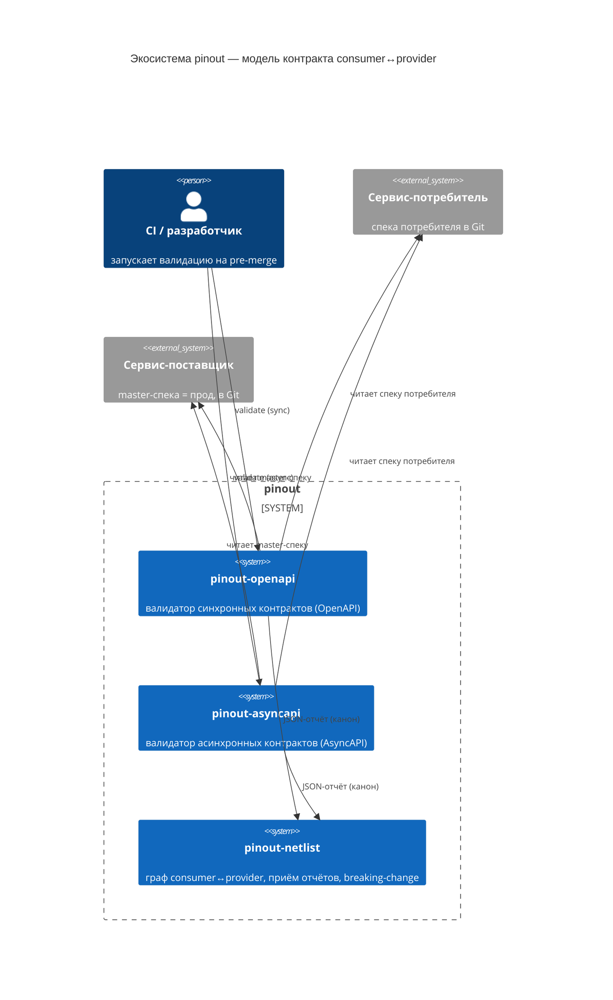

# pinout

Экосистема инструментов, которая проверяет совместимость сервисов по их машиночитаемым спецификациям (OpenAPI, AsyncAPI) **на pre-merge стадии в CI** — без генерации и публикации клиентских библиотек.

> Источник истины — спецификация в Git. Артефакт не публикуется; вместо этого пара «потребитель ↔ поставщик» сверяется автоматически до деплоя.

## Концепция

В электронике **pinout** — это распиновка микросхемы: какие сигналы идут на какие пины, какие напряжения, какие протоколы. Чтобы две микросхемы заработали вместе, их распиновки должны быть совместимы.

В микросервисной архитектуре роль pinout играет спецификация сервиса — OpenAPI для синхронных REST API или AsyncAPI для асинхронного обмена сообщениями. Спецификация описывает «распиновку» сервиса: какие операции он принимает, какие сообщения отправляет, по каким каналам и протоколам.

`pinout` делает то же, что continuity test на печатной плате: проверяет, что распиновки потребителя и поставщика сходятся **до** того, как сервисы попадут в продакшн и начнут падать на runtime-несовместимостях.

## Модель контракта: потребитель и поставщик

Для любого взаимодействия есть две роли:

- **Поставщик (provider)** — сервис, предоставляющий контракт (REST-эндпоинты или каналы/сообщения).
- **Потребитель (consumer)** — сервис, опирающийся на этот контракт.

Каждая сторона описана своей спецификацией в своём репозитории. pinout не вводит отдельный «язык контракта» — контрактом служит сама спецификация:

| Взаимодействие | Спецификация | Что сверяется | Модуль |
|---|---|---|---|
| Асинхронное (брокеры сообщений) | AsyncAPI 3.0 | канал, протокол, структура сообщений request/reply | `pinout-asyncapi` |
| Синхронное (REST) | OpenAPI 3.x | path/operation, схемы request/response, коды ответов | `pinout-openapi` |

Конфигурация пары едина для обоих модулей — файл `contract-tests.yaml` (путь/URL к спеке потребителя, путь/URL к master-спеке поставщика, перечень используемых потребителем каналов/операций).

### Карта экосистемы (C4 — System Context)

## Обоснование: спека-в-Git, а не генерированные библиотеки

**Несущий инвариант:** каждый сервис конформен своей спеке — доказано его компонентными тестами. **Всё
начинается с харнеса `izi`** ([rationaldev-ai-sdlc-skills](https://github.com/codemonstersteam/rationaldev-ai-sdlc-skills)),
который ведёт разработку каждого сервиса, применяя **его собственные скиллы** (проектирование/разработка/
документация/компонентные тесты). Отсюда: **совместимость спек-пары ⇒ реальная совместимость сервисов**. Сервис без доказанной
конформности → pinout даёт для его пары ложную уверенность.

**Почему не генерённые клиентские либы:** без привязки к языку · один источник истины (нет дрейфа) · шаг CI,
а не релиз-цикл либы · нет dependency hell · **двунаправленность** (ловит «потребителю нужно то, чего
поставщик не отдаёт») · Git достаточно (нет реестра/supply-chain) · shift-left (до merge).

> Полный разбор — инвариант, обоснование, **границы** (что pinout сознательно не делает), C4, алгоритмы,
> industry-аналог — в [`docs/CONCEPT.md`](docs/CONCEPT.md).

## Состав экосистемы

| Модуль | Назначение | Статус | Репозиторий |
|---|---|---|---|
| **pinout** | Зонтичный концепт-репозиторий: модель контракта, обоснование, верхнеуровневый бэклог экосистемы | 🚧 концепт | [codemonstersteam/pinout](https://github.com/codemonstersteam/pinout) |
| **pinout-asyncapi** | Валидатор контрактов AsyncAPI 3.0 между consumer и provider. Request-Reply, Fire-and-Forget, Pub-Sub. CLI для CI/CD | ✅ работает | [codemonstersteam/pinout-asyncapi](https://github.com/codemonstersteam/pinout-asyncapi) |
| **pinout-openapi** | Валидатор синхронных контрактов (bi-directional): статическая сверка `consumed-contract` потребителя (авто из стабов+тестов, с provenance) со схемой master-OpenAPI поставщика, поле-в-поле. Симметрично `pinout-asyncapi`. Семантику использования закрывают компонентные тесты потребителя (стаб+consumed-contract из спеки поставщика) | 📋 проектируется | [codemonstersteam/pinout-openapi](https://github.com/codemonstersteam/pinout-openapi) |
| **pinout-netlist** | Координатор связей: хранит граф consumer↔provider, версии и метаданные контрактов, принимает отчёты валидаторов, детектирует breaking-change во времени. Название — отсылка к netlist в PCB-дизайне | 📋 запланирован | [codemonstersteam/pinout-netlist](https://github.com/codemonstersteam/pinout-netlist) |
| **pinout-cli** | Единый CLI-фронт для всех валидаторов и работы с координатором | 📋 позже | — |

## Принципы

- **Спецификация — источник истины.** Контракт описан один раз в OpenAPI/AsyncAPI; валидаторы только проверяют совместимость.
- **Конформность сервиса своей спеке — предусловие.** Гарантируется компонентными тестами самого сервиса.
- **Локальный запуск в CI/CD.** Несовместимость обнаруживается на pre-merge стадии, а не в проде.
- **Модульность.** Каждый класс взаимодействия (REST, AMQP, MQTT, Kafka, …) — отдельный валидатор; общая модель consumer/provider и общий формат конфигурации.
- **Инженерная диагностика.** Ошибки с кодами, контекстом и местоположением — для людей и для машин (формат `ValidationError`, JSON-отчёт для netlist).
- **Honest reuse.** Schema-валидация и мокинг OpenAPI берутся из зрелых библиотек; уникальная часть pinout — оркестрация пары consumer↔provider и интеграция с netlist.

## Позиционирование

| Инструмент | Что делает | Чем отличается pinout |
|---|---|---|
| Pact (CDC) | Consumer-driven контракты через записанные взаимодействия (BDD-код), провайдер **реплеит** | pinout использует уже имеющиеся спеку + компонентные тесты, без отдельного контрактного кода и без реплея |
| **PactFlow Bi-Directional** | Статическая сверка контракта потребителя (из мок/стаба) ↳ OpenAPI поставщика | **Та же парадигма**, но pinout — open-source, Git-native, спека-native, с **provenance** и графом netlist; consumed-contract авто-извлекается и генерится обязательным шагом конвейера |
| Microcks / Prism | Мок и conformance по OpenAPI/AsyncAPI одного сервиса | pinout оркеструет **пару** сервисов и встраивает результат в граф зависимостей |
| oasdiff / openapi-diff | Диф двух версий одной OpenAPI | pinout: роль consumer↔provider (forward) + история во времени через netlist (reverse — там oasdiff и уместен) |

pinout опирается на эти библиотеки (`kin-openapi`, `oasdiff`), а не заменяет их.

## Roadmap

1. **pinout-asyncapi** — стабилизация и подготовка к интеграции с netlist (структурированный отчёт + расширение протоколов).
2. **pinout-openapi** — проектирование (skill `program-design`) и реализация (skill `program-implementation`) функции валидации соответствия контрактов; конфигурация симметрична `pinout-asyncapi`.
3. **pinout-netlist** — модель данных графа сервисов, приём отчётов валидаторов, детект breaking-change, визуализация зависимостей.
4. **pinout-cli** — единая точка входа для разработчиков и CI.

Детальные бэклоги (верхнеуровневый по экосистеме и пер-сервисные) ведутся в `backlog.md` концепт-репозитория и в `docs/design/` каждого сервиса — заполняются после пруфа концепта.

## Лицензия

Проекты экосистемы публикуются под открытой лицензией (см. `LICENSE` в каждом репозитории).
