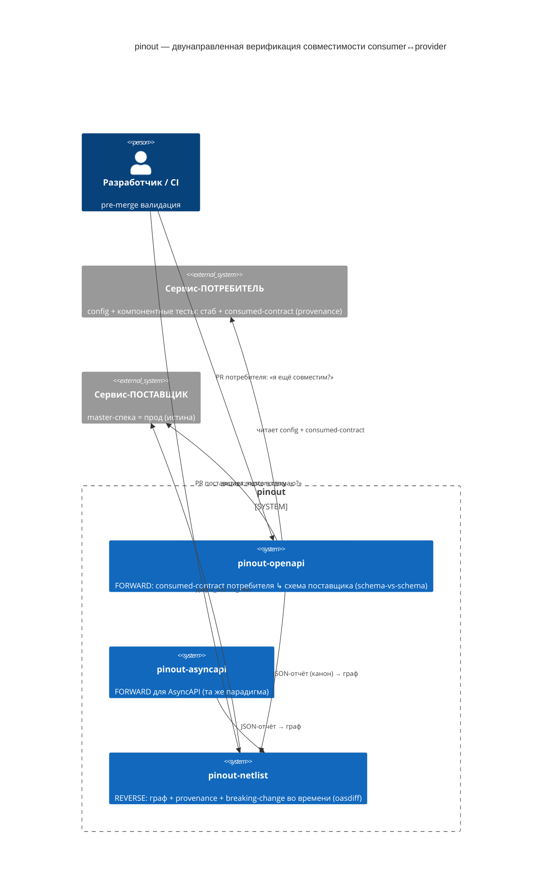

# pinout — парадигма: верификация контрактов ⋈ компонентные тесты

> Детальный концепт экосистемы (обзор — [`../README.md`](../README.md); лог идеи — [`../intent.md`](../intent.md)).
> Отсюда же выведена статья-white-paper (человекочитаемое обоснование).

## 1. Проблема и парадигма

В микросервисной архитектуре пара **потребитель↔поставщик** ломается на runtime-несовместимостях контракта:
поставщик изменил формат ответа, потребитель падает в проде. `pinout` ловит это **до мержа**, по
машиночитаемым спекам (OpenAPI/AsyncAPI) в Git, **без публикации клиентских библиотек**.

**Суть контрактного теста — совпадение по ФОРМАТУ, а не прогон всех развилок.** Контракт = структура
(схемы request/response, операции, коды), а не поведение. Значит верифицируем **форматную совместимость**
того, что потребитель шлёт/читает, с тем, что поставщик принимает/отдаёт.

## 2. Несущий инвариант

> **Каждый сервис конформен СВОЕЙ спеке — доказано его компонентными тестами.**

Компонентные тесты гоняют сервис как чёрный ящик против его спеки — **OpenAPI 3.x (синхронный REST)** или
**AsyncAPI 3.0 (асинхронный обмен через брокер: request-reply / pub-sub / fire-and-forget)** — плюс README.
Внешние зависимости заменяются **стабами по реальному протоколу**: HTTP-провайдер → HTTP-стаб; брокер-
провайдер → **брокер-стаб** (реальный транспорт, не in-code мок). **Всё начинается с харнеса `izi`**
([rationaldev-ai-sdlc-skills](https://github.com/codemonstersteam/rationaldev-ai-sdlc-skills)) — он ведёт
разработку каждого сервиса, применяя **его собственные скиллы** (проектирование/разработка/документация/
компонентные тесты — в т.ч. **генерация стаба+`consumed-contract` из спеки поставщика**, §7).
Отсюда: **совместимость спек-пары ⇒ реальная совместимость сервисов**, а не намерений. Это же —
обязательное предусловие безопасности **bi-directional** подхода (§7): раз провайдер не реплеит вызовы
потребителя, его спека (OpenAPI/AsyncAPI) обязана быть правдива — и это гарантируют его компонентные тесты.

## 3. Модель (исправленная и обоснованная)

Модель **симметрична для sync и async** — отличается только протокол-специфика (парсер, единица контракта, направления):

| | Синхронный — `pinout-openapi` | Асинхронный — `pinout-asyncapi` |
|---|---|---|
| Спека поставщика (истина) | OpenAPI 3.x (`kin-openapi`) | AsyncAPI 3.0 (AsyncAPI-парсер) |
| Единица контракта | операция (`path`+`method`) | канал + операция (`send`/`receive`) |
| Что сверяем | схемы request / response | схемы **payload** сообщений |
| Направления variance | request контравар. / response ковар. | **send** (publish) контравар. / **receive** (subscribe) ковар. |

**Общее ядро (оба протокола):**
- **Источник истины — спека ПОСТАВЩИКА**, грузит протокол-парсер (`kin-openapi` для OpenAPI / AsyncAPI-парсер для AsyncAPI).
- **Стаб генерится ИЗ спеки поставщика** (contract-true): HTTP-стаб (sync) / брокер-стаб (async) — потребитель не выдумывает поведение поставщика, а специфицирует, *как использует* контракт.
- **Ожидание потребителя — `consumed-contract`**, **авто-извлечённый** из его заглушек+тестов: проекция «какие
  операции/каналы зовёт × какие поля/payload **шлёт** / **читает**», типизированная из спеки поставщика на
  момент захвата. Это **схема формата**, не сырой стаб и не рукопись.
- **Provenance:** `consumed-contract` несёт `provider-version@capture + hash` → `netlist` трекает свежесть → авто-перепроверка при изменении поставщика.
- **Сверка — schema-vs-schema, поле-в-поле:** `consumed-contract` ↳ схема поставщика (по направлениям variance выше). Глубина (вложенность/типы/enum/format/nullable) — **даром** от валидации схемы.

Почему не «две полные спеки» и не «сырой стаб»: реальный потребитель (напр. брокер-интеграция, дёргающая
REST **и** шлющая сообщения) не ведёт отдельную «ожидаемую спеку поставщика» (ни OpenAPI, ни AsyncAPI), а
сырой стаб — это инстанс (пример), не формат. `consumed-contract` даёт schema-shaped формат (полная сверка
ковариантности) при нулевой ручной поддержке (авто-извлечение из уже существующих заглушек+тестов).

## 4. C4 — System Context



## 5. C4 — Container (pinout-openapi, forward)

```mermaid
C4Container
  title pinout-openapi — functional core / imperative shell
  Person(ci, "CI", "")
  System_Ext(prov, "master-OpenAPI поставщика", "")
  System_Ext(cc, "consumed-contract потребителя", "схема + provenance")
  Container_Boundary(t, "pinout-openapi CLI") {
    Container(cli, "cli/ (дверь)", "cobra", "run <config> → exit 0/1/2/3 + JSON")
    Container(pl, "provider loader", "kin-openapi", "parse + $ref + validate → openapi3.T")
    Container(ccl, "consumed-contract loader", "Go", "схема {ops × read/sent} + provenance")
    Container(core, "compat core (ЯДРО)", "schema-vs-schema", "поле-в-поле: request контравар. / response ковар.; рекурсивно")
    Container(rep, "report writer", "Go", "Finding[] → verdict + канон-отчёт (для netlist)")
  }
  Rel(ci, cli, "run")
  Rel(cli, pl, "load(provider)"); Rel(pl, prov, "GET/read")
  Rel(cli, ccl, "load(consumed-contract)"); Rel(ccl, cc, "read")
  Rel(cli, core, "compat(cc, providerSchema)"); Rel(core, rep, "findings")
```

## 6. Алгоритмы (функциональный стиль)

### FORWARD — потребитель → поставщик (`pinout-openapi`/`pinout-asyncapi`)
ROP-труба; шаги короткозамыкаются; `incompatible` — вердикт, не ошибка:
```
checkConsumerToProvider(config) -> Result<Report, Error>:
  | loadProviderSpec(config.provider)                 -> ProviderSpec   # kin-openapi; fail → PROVIDER_*/SPEC_*
  | loadConsumedContract(config.consumer)             -> ConsumedContract # схема {ops × read/sent} + provenance; нет → CONTRACT_MISSING
  | resolveOps(ConsumedContract.ops, ProviderSpec)    -> []Op           # каждая op ЕСТЬ у поставщика; нет → OP_NOT_IN_PROVIDER
  | flatMap(Ops, compatOp)                            -> []Finding      # ЯДРО, per op (schema-vs-schema):
  |     requestContravariant(cc.request, op.requestSchema)   -> []Finding  #  поставщик принимает то, что потребитель шлёт?
  |     responseCovariant(cc.response, op.responseSchema)    -> []Finding  #  потребитель читает лишь то, что поставщик отдаёт?
  |         # рекурсивно: вложенность/типы/enum/format/nullable — ДАРОМ
  | aggregate(Findings)                               -> Verdict        # findings≥1 ⇒ incompatible
  | buildReport(Verdict, Findings, provenance)        -> Report         # exit 0|1; канон-отчёт → netlist
```

### REVERSE — поставщик меняет контракт → кто сломается (`pinout-netlist`)
Здесь **oasdiff уместен** (две версии ОДНОЙ спеки поставщика) + граф:
```
detectBreakingImpact(providerNew) -> Result<ImpactReport, Error>:
  | fetchPrevious(provider.id)                        -> ProviderOld    # предыдущая master-версия из графа
  | oasdiff.breaking(base=ProviderOld, rev=providerNew) -> []Breaking   # диф во времени, deep
  | map(Breaking, affectedOp)                         -> Set<Op>
  | queryGraph(AffectedOps)                           -> []Consumer     # кто зависит (рёбра + provenance-версии)
  | filter(Consumers, stubProvenanceCovers)           -> []Impact       # только те, чей consumed-contract затронут
  | buildImpactReport(Impacts)                        -> ImpactReport   # гейт мержа поставщика
```

## 7. Дисциплина — генерация И механический контроль

Инвариант держится только если стаб+`consumed-contract` **contract-true и свежие**. Проза скилла это не
гарантирует (её пропускают) → двухслойный энфорс:

| Слой | Что | Держит |
|---|---|---|
| скилл `component-tests` (доработка) | генерит стаб + `consumed-contract` из спеки поставщика + provenance | методология |
| валидатор `validate-consumed-contract` | сгенерён-из-спеки, provenance есть, версия совпала | **poka-yoke** |
| гейт (`wirth-tester` consequent + `@fagan` DoD) | зовёт валидатор → блок при нарушении | **механизм** |

**Обязательный шаг конвейера потребителя:** при создании/изменении API поставщика — перегенерировать стаб+
`consumed-contract` (свежий provenance). Не рекомендация — гейт.

## 8. Industry & design rationale

`pinout-openapi` (forward) — это **bi-directional contract testing**: контракт потребителя (из мок/стаба)
статически сверяется с OpenAPI поставщика, без реплея. Индустрийный аналог — **PactFlow Bi-Directional**
([pactflow.io](https://pactflow.io/bi-directional-contract-testing/); [basic guide, Stoplight](https://blog.stoplight.io/bi-directional-contract-testing-a-basic-guide-to-api-contract-testing-compatibilities);
[getting started, Sngular](https://www.sngular.com/insights/87/the-easy-way-to-get-started-with-bi-directional-contract-testing)):
контракт потребителя генерят из Wiremock/Pact, provider contract = OpenAPI, сверка **до уровня поля**;
PactFlow отчитываются о **>50% экономии усилий** vs full-CDC для провайдера.

| Подход | Механизм | Где в pinout |
|---|---|---|
| Full CDC (Pact) | consumer tests → pact → провайдер **реплеит** | — (мы без реплея) |
| **Bi-directional** (PactFlow) | contract потребителя (стаб) ↳ OpenAPI, статически | **forward** (pinout-openapi/asyncapi) |
| Schema-diff (oasdiff/registry) | две версии одной спеки, breaking-change | **reverse** (pinout-netlist) |
| Mock/conformance (Microcks/Prism) | мок + conformance одного сервиса | несущий инвариант (методология) |

**Greenfield-преимущество:** мы владеем стандартом разработки → превращаем слабые места bi-directional в
гарантии *by construction*: (1) `consumed-contract` авто-извлекается (schema-shaped, ловит ковариантность);
(2) provenance штампуется при генерации → netlist трекает свежесть; (3) coverage — first-class выход
(«compatible на покрытой поверхности N%»); (4) self-conformance поставщика — обязательный гейт (то, что
PactFlow требует, но не может заэнфорсить между орг — а мы можем внутри своей инфры); (5) стаб+contract
генерятся из спеки поставщика обязательным шагом. Единственная слабость bi-directional (instance-vs-schema,
coverage) снимается авто-извлечённым `consumed-contract`.

## 9. Дуальность

| | FORWARD (`pinout-openapi`/`asyncapi`) | REVERSE (`pinout-netlist`) |
|---|---|---|
| Триггер | PR **потребителя** | PR **поставщика** |
| Вопрос | «я совместим СЕЙЧАС?» | «кого я сломаю ЭТИМ?» |
| Вход | схема поставщика + `consumed-contract` (provenance) | provider **v_old→v_new** + граф |
| Механизм | schema-vs-schema (kin-openapi) | oasdiff (spec↳spec) + граф |
| Роль | пара **сейчас** | история **во времени** |

## 10. Границы и открытые вопросы

**Границы:** не проверяет конформность сервиса своей спеке (это его компонентные тесты); не сравнивает две
полные спеки; не детектит breaking-change во времени (это netlist); не даёт готовый клиент.

**Открытые вопросы (проработка в компонентах):** формат/извлечение `consumed-contract` из стабов; что
валидировать в request (path/query/headers/body); режимы отказа → exit-коды + `error.code`; поставщик
(`spec_url`/`spec_path`/auth/таймаут); канон отчёта (+`schema_version` для netlist); границы MVP; coverage-метрика.
